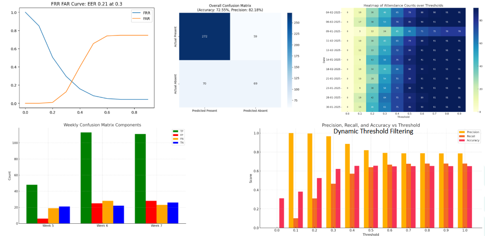
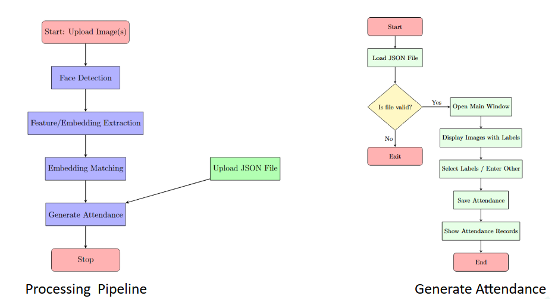
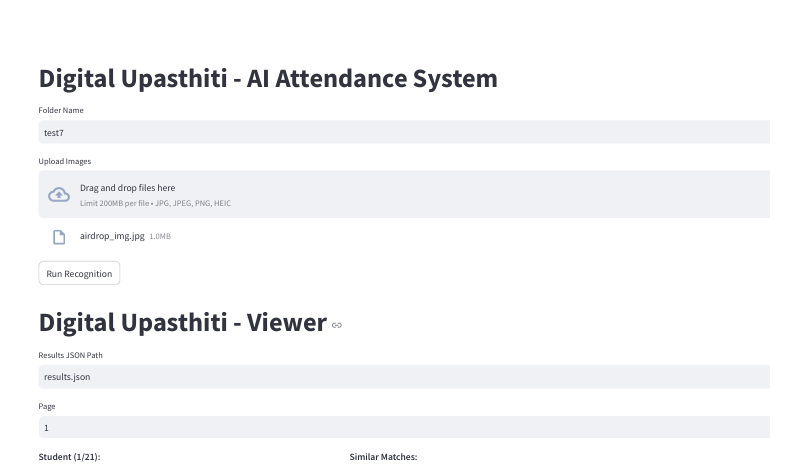

# Digital Upasthiti - [AI Attendence System]
## DL Project - Class FR

Semi-Automated, Fully Automated

Demo Video [https://www.youtube.com/watch?v=aUGacMKmDQQ](https://www.youtube.com/watch?v=aUGacMKmDQQ)

###  [ Important Note(s) ]
- If PC has issues running Tensorflow, `src/config.py` set `use_TF = False` 
- Check src/config.py before running anything, ensure paths are correct. 
- All scripts are created respect to src folder, so ensure `cd src` 
- General Requirements
    ```
    ## Development PC Config
    GPU 4060Ti - 8GB (Usage 1-2 GB during run)
    32 GB RAM - (Usage + 5-6 GB during run) 

    ## Library Versions
    >>> Python 3.10.14 | packaged by Anaconda, Inc. | (main, May  6 2024, 19:44:50) [MSC v.1916 64 bit (AMD64)] on win32
    >>> torch.__version__ '2.4.1'
    >>> tf.__version__ '2.19.0'
    ```
- Semi Automated Mode - Generates invdividual csv for each set of photos uploaded, Later need to merge for all days after curation (script provided) [correct date should be in csv `pred_dd-mm-yyyy.csv` Failing which, results will be incorrect]
- Fully Automated Mode - It needs month folder containing all images per day [with correct `dd-mm-yyyy` format] ensure folder path to be changed in `generate_evaluation_csv.py` file
- Images can be of any type, all handled. 
- Further flexibility can be added, later as per requirements :)
- Isssues and PR are appreciated. 
- Run Non-GUI version for faster evaluation. 

--- 
Both conda and pip are available to setup environment
## Setting up [pip]
1. Install `requirements.txt` pip install -r requirements.txt
2. Move to src folder
3. Set the `config.py` [keep defaults if unsure]

## Setting up [conda] 
1. conda env create -f environment.yaml - then activate it
2. Move to src folder
3. Set the `config.py` [keep defaults if unsure]

## To Run & Generate Results [GUI]
1. `cd src`
2. `streamlit run gui/main_upload_streamlit.py` To run Streamlit GUI Server
3. Server will run, GUI will open in browser window. [if installation is correct]
4. Enter the folder name in `dd-mm-yyyy` format before uploading
5. Upload the images by clicking photos, gallery, or drag and drop
6. Click - `Run Recognition` - and processing will start. Results will be displayed in GUI.
7. Intelligently it will mark correct the good matches, But match for each student is also displayed, if you feel it is wrong you can un-tick the box. 
8. If you see, a correct one is missed due to high threshold, tick the box, it will be counted in attendance. 
9. After cleaning all the results, once satisfied click `save attendance` at the end. 
10. It will show the saved path, click on `show attendance` to view or download. 
11. It contains all the students marked present by Algorithm, or by Manual TA. Save it with `pred_dd-mm-yyyy.csv` in single folder. [can use same folder for all prediction csv]
12. csv will have roll no and score, that can be later used as well. 

```
Roll,Score
2022408,0.083
mt24002,0.099
mt23125,0.106
2021562,0.107
```

13. After generating all csv's To merge all days attendance to one, use the script in src `python merge_attendance.py`to generate final csv with `A` and `P` [It needs a blank list of students enrolled in class, to maintain correct order, this file should be in `data` folder (sample attached)] (change folder name inside)

```
Roll No,,,,,,,,,,,
MT24002,,,,,,,,,,,
2021162,,,,,,,,,,,
2021197,,,,,,,,,,,
2021200,,,,,,,,,,,
```

[Optional] To just view results.json for past results processed use `streamlit run gui/main_streamlit.py` To run Streamlit Viewer

## To Run & Generate Results [Non-GUI]
1. `cd src`
2. Configure `src/config.py`
3. This script needs a folder images of multiple days 
```
E:.
└───final_eval
    ├───01-04-2025
    ├───09-04-2025
    └───17-04-2025
```
3. `python generate_evaluation_csv.py` (change folder name)
4. It will generate final combined csv, along with prediction for each day, in the same folder.


## Folder Description
- assets - for github assets
- data 
    - GT images - for generating features
    - student_list.csv - for final results prepration
    - pkl file of features
    - students_details.json
- extra - extra stuff and past data, for future use
- RECORDS - to contain evaluation photos, results
- run_files - temporary files, folders for intermediate data
- src - containing source code

## Plots


## Flow Chart



# Screenshots



## Credits
- Vinay 
- Meet
- Pranjal